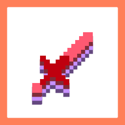

# Advantimations

[Modrinth](https://modrinth.com/project/advantimations)

(credit to [thebaum64](https://modrinth.com/user/thebaum64) for [original texture](https://modrinth.com/resourcepack/default-hd-128x))

Client-side mod to cancel animations

## Dependencies

- [Fabric API](https://modrinth.com/mod/fabric-api)
- [YetAnotherConfigLib (YACL)](https://modrinth.com/mod/yacl)
- [Mod Menu](https://modrinth.com/mod/modmenu) to reach the config screen (please do it)

## Features

Item Model

- Cancel Swings

- Cancel Eating Animation
- Cancel Drinking Animation
- Cancel Blocking Animation
- Cancel Shield Animation
- Cancel Bow Animation
- Cancel Crossbow Animation
- Cancel Charged Crossbow Animation
- Cancel Spyglass Animation
- Cancel Horn Toot Animation
- Cancel Trident Spear Animation
- Cancel Riptide Animation
- Cancel Brushing Animation
- Cancel Bundle Animation
- Cancel Bow Arrow Model
- Cancel Crossbow Arrow Model

- Cancel Attack Cooldown Resets
- Cancel Block Interact Resets
- Cancel Item Interact Resets
- Cancel Slot Swapping Resets

Entity Model

- Cancel Limb Movements
- Weirder Limb Movements
- Cancel Sneaking

## Developing

This mod is only tested on the latest supported version in a development environment (currently 1.21.8),
and it is tested on all supported versions in production (only Fabric + dependencies).
If a change is minor, it will only be tested on the latest supported version in development and production.